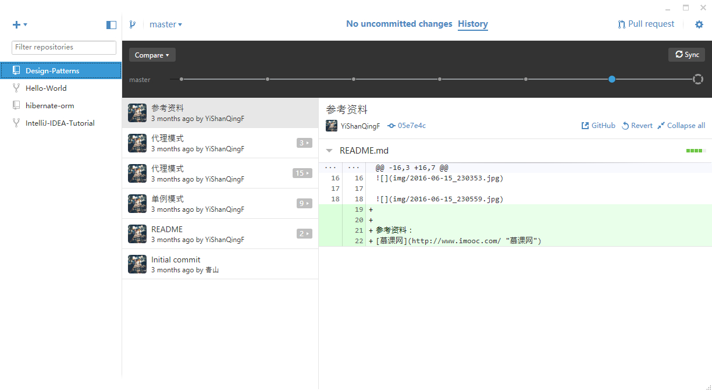

# 安装Git

## 在Linux上安装Git
```
sudo yum install git
```

## 在Ubuntu上安装Git
```
sudo apt-get install git
```

## 在Windows下安装是最坑的

[这里有离线安装包](http://pan.baidu.com/s/1c2A4UTa)
下载后直接点击`GitHub.application`安装即可



一直没搞明白[git for windows](https://git-for-windows.github.io/)与[GitHub Desktop](https://desktop.github.com/)的区别，有哪位大神指点一二

**参考资料**

[Linux下安装Git](http://www.cnblogs.com/zhcncn/p/4030078.html)

[linux下git的安装和使用](http://www.cnblogs.com/sunada2005/archive/2013/06/06/3121098.html)
