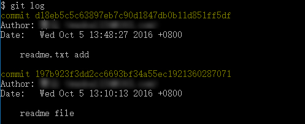
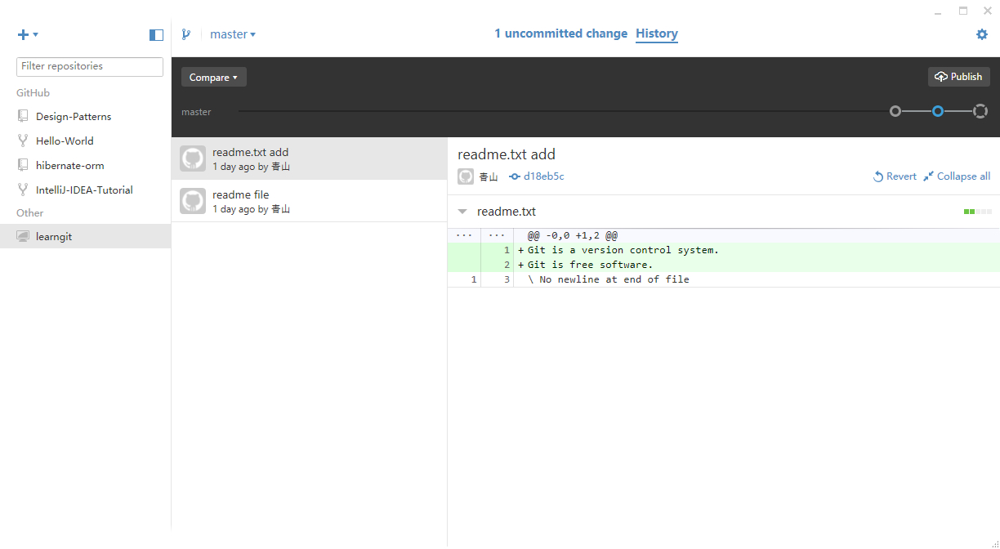

# 版本回退

工作场景假设：

当我们要回退到之前修改的版本。处理命令 `git log` `git log --pretty=oneline` `git reflog` `git reset --hard commit_id`

## 提交日志查看
### git log


### git log --pretty=oneline

```
$ git log --pretty=oneline
d18eb5c5c63897eb7c90d1847db0b11d851ff5df readme.txt add
197b923f3dd2cc6693bf34a55ec1921360287071 readme file
```

需要友情提示的是，你看到的一大串 d18eb5c5c63897eb7c90d1847db0b11d851ff5df 是commit id（版本号），和SVN不一样，Git的commit id不是1，2，3……递增的数字，而是一个SHA1计算出来的一个非常大的数字，用十六进制表示，而且你看到的commit id和我的肯定不一样，以你自己的为准。为什么commit id需要用这么一大串数字表示呢？因为Git是分布式的版本控制系统，后面我们还要研究多人在同一个版本库里工作，如果大家都用1，2，3……作为版本号，那肯定就冲突了。


每提交一个新版本，实际上Git就会把它们自动串成一条时间线。如果使用可视化工具查看Git历史，就可以更清楚地看到提交历史的时间线


## git reset --hard commit_id

在`Git`中，用`HEAD`表示当前版本，也就是最新的提交d18eb5c5c63897eb7c90d1847db0b11d851ff5df（注意我的提交ID和你的肯定不一样），上一个版本就是`HEAD^`，上上一个版本就是`HEAD^^`，当然往上100个版本写100个`^`比较容易数不过来，所以写成`HEAD~100`。


现在，我们要把当前版本“readme.txt add”回退到上一个版本“readme file”，就可以使用`git reset`命令：
```
git reset --hard HEAD^
git reset --hard 197b923f3d
```

`Git`的版本回退速度非常快，因为`Git`在内部有个指向当前版本的`HEAD`指针，当你回退版本的时候，`Git`仅仅是把`HEAD`指向`readme file`

**查看当前的日志**
```
$ git log --pretty=oneline
197b923f3dd2cc6693bf34a55ec1921360287071 readme file
```

**查看所有的日志**
```
$ git reflog
197b923 HEAD@{0}: reset: moving to HEAD^
d18eb5c HEAD@{1}: commit: readme.txt add
197b923 HEAD@{2}: commit (initial): readme file
```

http://player.youku.com/player.php/sid/XMTc1MDUxOTk3Mg==/v.swf


## 小结

 * `HEAD`指向的版本就是当前版本，因此，`Git`允许我们在版本的历史之间穿梭，使用命令`git reset --hard commit_id`。

 * 穿梭前，用`git log`可以查看提交历史，以便确定要回退到哪个版本。

 * 要重返未来，用`git reflog`查看命令历史，以便确定要回到未来的哪个版本。

[参考资料](http://www.liaoxuefeng.com/wiki/0013739516305929606dd18361248578c67b8067c8c017b000/0013744142037508cf42e51debf49668810645e02887691000)
