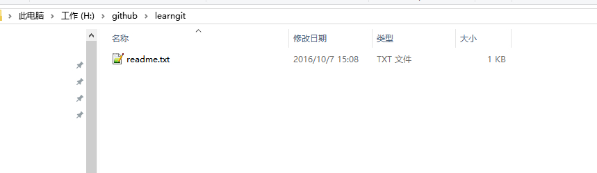

# 工作区和缓存区

## 工作区(Working Directory)
就是你在电脑里能看到的目录，比如我的`learngit`文件夹就是一个工作区：

## 版本库(Repository)
工作区有一个隐藏目录`.git`，这个不算工作区，而是Git的版本库

`Git`的版本库里存了很多东西，其中最重要的就是称为`stage`（或者叫index）的暂存区，还有`Git`为我们自动创建的第一个分支`master`，以及指向`master`的一个指针叫`HEAD`。

前面讲了我们把文件往`Git`版本库里添加的时候，是分两步执行的：

 * 第一步是用`git add`把文件添加进去，实际上就是把文件修改添加到暂存区；
 * 第二步是用`git commit`提交更改，实际上就是把暂存区的所有内容提交到当前分支。

[参考资料](http://www.liaoxuefeng.com/wiki/0013739516305929606dd18361248578c67b8067c8c017b000/0013745374151782eb658c5a5ca454eaa451661275886c6000)
