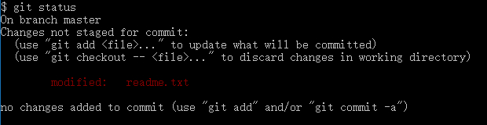
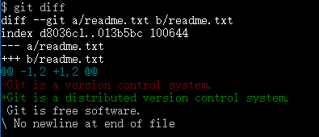
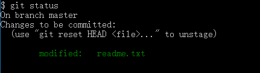

# 工作区状态查看

工作场景假设：

当我们修改、新增、删除工作区的内容时，要查看他的是否提交以及修改文本内容的比较。处理命令 `git status` `git diff`

## git status

工作区没有任何内容修改时
```
$ git status
On branch master
nothing to commit, working directory clean
```

修改`readme.txt` 内容之后 `git status` 的删除结果



`git diff` 的输出结果



`git status`命令可以让我们时刻掌握仓库当前的状态

`git diff`顾名思义就是查看difference，显示的格式正是Unix通用的diff格式，可以从上面的命令输出看到，我们在第一行添加了一个“distributed”单词。


知道了对`readme.txt`作了什么修改后，再把它提交到仓库就放心多了，提交修改和提交新文件是一样的两步，第一步是`git add`

```
$ git add readme.txt
```

同样没有任何输出。在执行第二步`git commit`之前，我们再运行`git status`看看当前仓库的状态



`git status`告诉我们，将要被提交的修改包括`readme.txt`，下一步，就可以放心地提交了

```
$ git commit -m "add distributed"
[master ea34578] add distributed
 1 file changed, 1 insertion(+), 1 deletion(-)
```

## 小结

 * 随时掌握工作区的状态，使用`git status`命令
 * `git status`告诉你有文件被修改过，用`git diff`可以查看修改内容
